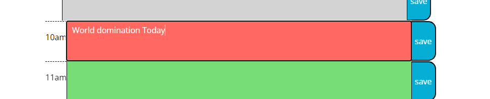

# Work Day Scheduler

## Description

Very simple web utility to plan your day. Has hours from 9-5 and an area to enter what you have planned for those hours. It is then neatly color coded by present, future and past hours. And upon hiting the save button your text is saved.

## Table Of Cotents

- [Installation](#installation)
- [Usage](#Usage)
- [Git Pages](#pages)

## Installation
To get this up and runing simply download the repo. Extract and navigate your browser to the location of the index.html.

## Usage
To use this little tool simply load it up. Enter what you want in what hour. Hit the save button and like magic you have your day planned an saved.

Type in the box.

Click Save

Boom!

## Pages

If you would like to view this live. Github has this great utility called Gitpages where you can host stuff.
If you click [here](https://hahkeye.github.io/greatest-scheduler-alive/)